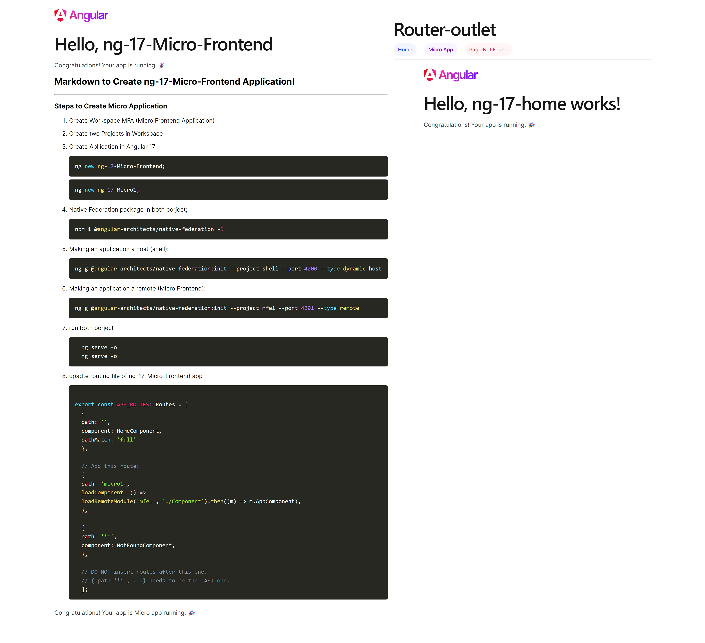

## Markdown to Create ng-17-Micro-Frontend Application

### Steps to Create Micro Application

1. Create Workspace MFA (Micro Frontend Application)

2. Create two Projects in the Workspace

3. Create an application in Angular 17

    \`\`\`typescript
    ng new ng-17-Micro-Frontend;
    \`\`\`

    \`\`\`typescript
    ng new ng-17-Micro1;
    \`\`\`

4. Native Federation package in both projects;

    \`\`\`typescript
    npm i @angular-architects/native-federation -D
    \`\`\`

5. Making an application a host (shell):

    \`\`\`typescript
    ng g @angular-architects/native-federation:init --project shell --port 4200 --type dynamic-host
    \`\`\`

6. Making an application a remote (Micro Frontend):

    \`\`\`typescript
    ng g @angular-architects/native-federation:init --project mfe1 --port 4201 --type remote
    \`\`\`

7. run both projects

    \`\`\`typescript
      ng serve -o
      ng serve -o
    \`\`\`

8. update routing file of ng-17-Micro-Frontend app

    \`\`\`typescript

    export const APP_ROUTES: Routes = [
      {
      path: '',
      component: HomeComponent,
      pathMatch: 'full',
      },

      // Add this route:
      {
      path: 'micro1',
      loadComponent: () =>
      loadRemoteModule('mfe1', './Component').then((m) => m.AppComponent),
      },

      {
      path: '**',
      component: NotFoundComponent,
      },

      // DO NOT insert routes after this one.
      // { path:'**', ...} needs to be the LAST one.
      ];
    \`\`\`

## Congratulations! Your app is a Micro app running. 🎉
